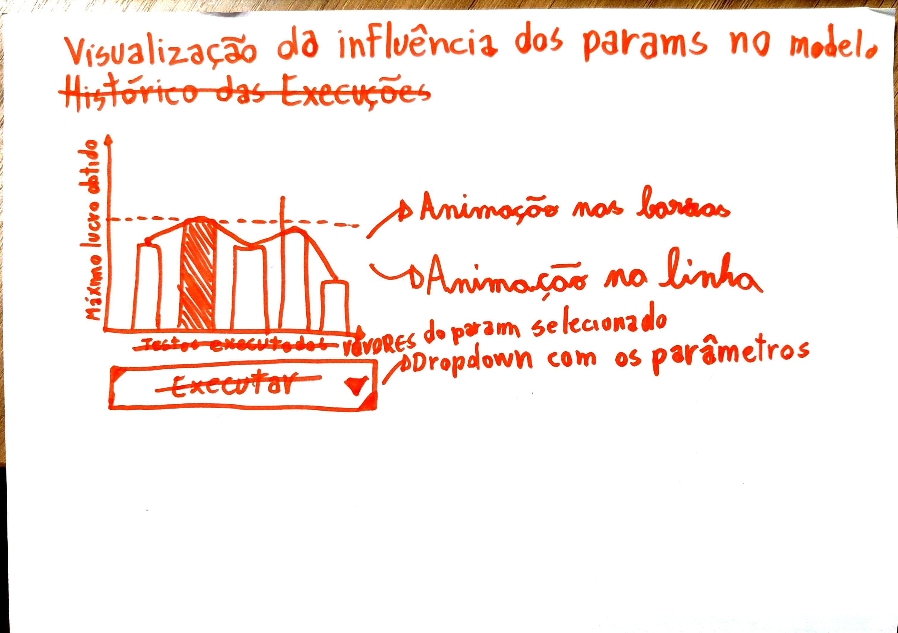

# 1. Introdução à proposta

O objetivo central é visualizar a correlação entre os parâmetros do modelo (como limite máximo concedível, taxa de utilização, inadimplência e multiplicadores de alavancagem) e o **retorno máximo obtido** para cada variação dos valores de cada parâmetro. Portanto, o usuário deve ser capaz de entender como os valores de um determinado parâmetro influenciam no máximo retorno obtido do modelo, entendendo qual seria o valor ideial de cada parâmetro individualmente.

Através da microinterface, o usuário pode selecionar o parâmetro desejado em um menu *dropdown*. O gráfico em barras reage automaticamente à escolha do usuário: ele redimensiona as réguas dos eixos cartesianos, anima o crescimento simultâneo de todas as barras e destaca a opção de maior rendimento através de uma transição suave para a cor **Azul Pan**, enquanto as demais mantêm a cor Azul Royal. Além disso, uma tabela informativa é construída e atualizada no HTML em tempo real para exibir exatamente qual foi o valor do parâmetro responsável por esse pico de rentabilidade.

# 2. Rascunhos iniciais

Inicialmente eu tinha pensado apenas em um gráfico que mostrada o histórico de resultados executados (evidenciados pelos textos rasurados na imagem), mas depois evoluí a ideia para a visualização dos parâmetros em relação ao retorno obtido.

# 3. Registro do resultado obtido

O resultado final está no arquivo `index.html`, com a lógica de animação e plotagem separada no arquivo `script.js` e consumindo dados fixos espalhados sem correlação do arquivo `data.js`.

**Principais features alcançadas:**
- **Gráfico**: O gráfico escalona a grade de fundo sozinho, com margens calculadas com base nos valores máximos lidos do array de resultados.
- **Animações**: Foi implementado uma animação usando o p5.js. As barras crescem simultaneamente do eixo `y=0` até seus topos de forma suave.
- **Transição de Cor Automática**: Usando a função `lerpColor`, a barra que possui a maior altura (maior retorno) troca de cor para Azul Pan ativamente assim que a animação de crescimento das barras termina.
- **Integração Canvas x DOM**: Os dados não vivem apenas no desenho; eles se refletem em uma tabela formatada nativamente pelo navegador, acima do gráfico, garantindo acessibilidade a leitura exata do resultado e conectando interações no `<select>` diretamente com as variáveis do *canvas*.